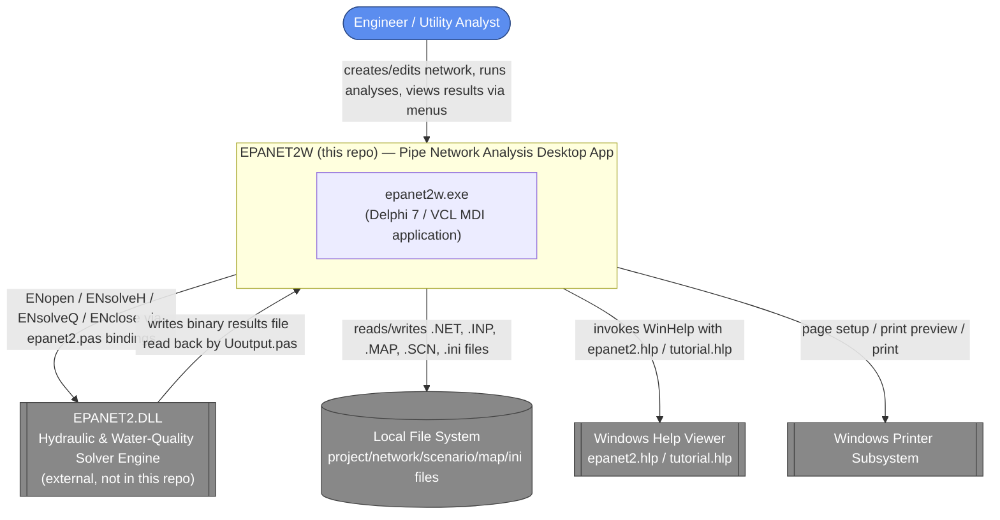
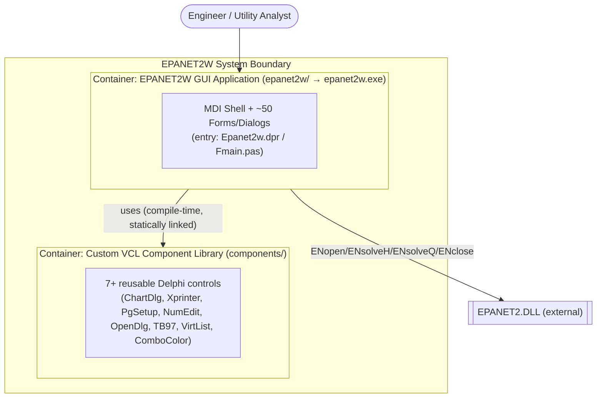
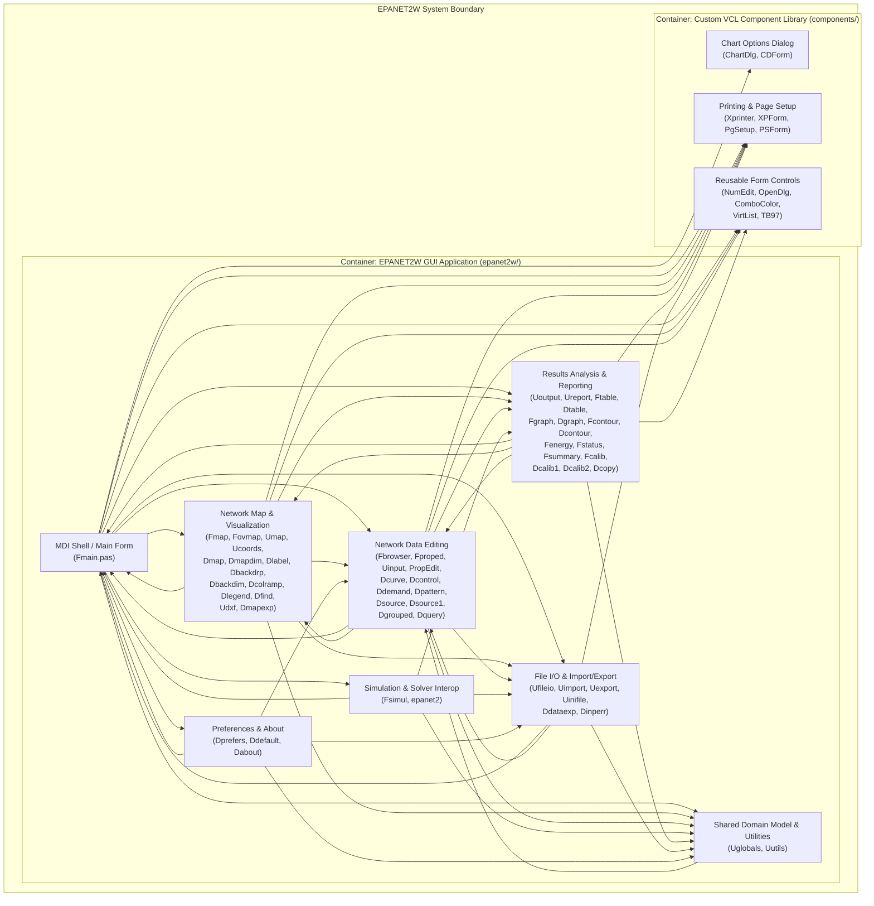
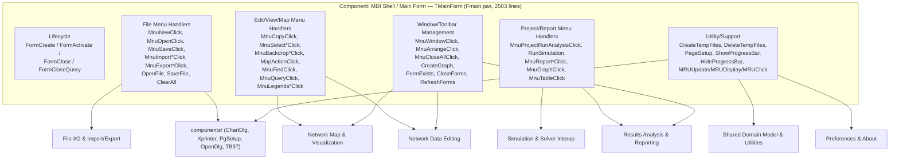

# Architecture Report: EPANET2W — Pipe Network Analysis Desktop Application

**Path analyzed:** c:\Learnings\Projects\EPANET-legacy-user-interface
**Date analyzed:** 2026-07-22

## System Context (L1)

### Narrative

- **The system**: a single-EXE Windows desktop GUI, `epanet2w.exe`, built from `epanet2w/Epanet2w.dpr`. The `.dpr`'s entry point confirms the shape: `Application.Initialize; Application.Title := 'EPANET 2'; Application.CreateForm(TMainForm, MainForm); Application.Run;` (read directly from `epanet2w/Epanet2w.dpr`, also captured verbatim in the collected manifest). `epanet2w/Epanet2w.dof`'s `[FileVersion]` section reads `Version=7.0`, and `epanet2w/README.md` states "The code has been compiled successfully with the Professional Version of Borland's Delphi 7" — confirming the Delphi 7 / VCL toolchain.
- **User**: the sole human actor. `epanet2w/Fmain.pas`'s header states this unit "contains the main MDI parent form, MainForm. It handles all user selections from the main menu" — the entire application is driven by menu/dialog interaction from one engineer/analyst at a time (no multi-user or network-service surface was found anywhere in the collected file enumeration).
- **EPANET2.DLL (external solver engine)**: `epanet2w/epanet2.pas` is purely an import-binding unit — its header states "Declarations of imported procedures from the EPANET PROGRAMMERs TOOLKIT (EPANET2.DLL)" — and `epanet2w/Fsimul.pas` (read directly, lines 141-171) drives it: `err := ENopen(PChar(TempInputFile),PChar(TempReportFile), PChar(TempOutputFile)); ... if (err = 0) ... err := RunHydraulics; ... RunQuality; ENclose;`. The DLL itself is confirmed absent from the repo (no `.dll` file appears in `top_level_dirs`), so it is modeled as an external system.
- **Local File System**: `epanet2w/Ufileio.pas`'s header states it "reads network database from .NET file and saves network database to .NET file"; `epanet2w/Fmain.pas`'s constants (`TXT_OPEN_PROJECT_FILTER = 'Network files (*.NET)|*.NET|Input file (*.INP)|*.INP|...'`, read directly) confirm `.NET`/`.INP`/`.BAK`/`.SCN`/`.MAP` file interchange. `epanet2w/Uinifile.pas` reads/writes program setup to an `.ini` file per its listing in `epanet2w/README.md`.
- **Windows Help Viewer**: `epanet2w/consts.txt` (read directly) declares `HLPFILE = 'epanet2.hlp';` and `TUTORFILE = 'tutorial.hlp';`, and `epanet2w/README.md` lists these among the files the exe "works together with" — confirming a WinHelp integration point outside this repo's own compiled output.
- **Windows Printer Subsystem**: `epanet2w/Fmain.pas`'s `uses` clause imports `Printers, PgSetup, ... Xprinter` directly (read directly, line 30-34), and `components/Xprinter.pas`/`components/PgSetup.pas` are dedicated print-preview/page-setup components per `components/README.md`.

## Containers (L2)

### Narrative

- Exactly two top-level directories exist in the repo (`top_level_dirs`): `components/` and `epanet2w/`. Root `README.md` (read directly) describes them as two separately-zipped, separately-versioned deliverables — `components.zip` ("last updated on 7/5/06") and presumably `epanet2w.zip` — where "components.zip -- Custom Delphi components that must be installed into the Delphi IDE's component palette before working with the GUI code."
- **EPANET2W GUI Application container**: the single deployable unit, `epanet2w.exe`, whose sole entry point is `epanet2w/Epanet2w.dpr`. Its `uses` clause (read via the collected manifest and directly consistent with `top_level_dirs`) enumerates ~60 in-repo Pascal units and lists no external package dependency mechanism — this is one monolithic executable, not a set of independently-deployable services.
- **Custom VCL Component Library container**: not independently runnable — it produces no `.exe`/`.dll` of its own — but it is a distinct build-time dependency with its own README, its own versioning cadence, and a hard IDE-installation prerequisite documented in `epanet2w/README.md`: "Before loading the EPANET2W project into the Delphi IDE you must install the collection of EPANET2W custom components on to Delphi's Component Pallette." `epanet2w/Fmain.pas`'s `uses` clause imports `PgSetup, OpenDlg, TB97, ChartDlg, Xprinter` directly from this container (confirmed by reading the file), and the `dependency_graph` records the corresponding edges (e.g. `Fmain.pas -> components/ChartDlg.pas`), so the two containers cannot be built or versioned independently of one another even though they end up in one binary.
- No other runnable containers (no server, no CLI, no scheduled worker, no database) are evidenced anywhere in `top_level_dirs`, `manifests`, or the files opened.

## Components (L3)

### Narrative

Components are file clusters grouped by responsibility and confirmed against opened files; every edge above corresponds to at least one `dependency_graph` entry between a file in the source component and a file in the target component (self-loops within a component are omitted).

- **E1 — MDI Shell / Main Form** (`Fmain.pas`, 2503 lines): confirmed as the application's control hub. Its own header states it "contains the main MDI parent form, MainForm. It handles all user selections from the main menu." A `grep` of its own source for `procedure TMainForm.` / `function TMainForm.` returns over 90 methods (`FormCreate`, `MnuFileClick`, `MnuOpenClick`, `MnuProjectRunAnalysisClick`, `MnuReportClick`, `RunSimulation`, `RefreshForms`, `CreateGraph`, etc.), and it is the most connected node in `dependency_graph` by a wide margin — 38 outbound edges and 29 inbound edges (`grep` count against the collected JSON) — touching every other component in the system, including the components/ container directly (`Fmain.pas -> components/PgSetup.pas`, `-> components/OpenDlg.pas`, `-> components/TB97.PAS`, `-> components/ChartDlg.pas`, `-> components/Xprinter.pas`).
- **E2 — Network Map & Visualization**: `epanet2w/Umap.pas`'s header (read directly) states it "defines the TMap object. This object contains drawing methods for rendering the Network Map on a memory bitmap. It also draws the map legends, identifies the bounding rectangle for an object, and handles map re-scaling." `epanet2w/README.md` describes `Fmap.pas`/`MapForm` as "a MDI child form that displays an editable schematic of the pipe network" and `Fovmap.pas`/`OVMapForm` as showing "the current view extent ... on an outline map." `dependency_graph` ties in the map-option dialogs (`Dmap.pas -> Umap.pas`, `Dbackdim.pas -> Fmap.pas`/`Fovmap.pas`/`Ucoords.pas`, `Dlegend.pas -> Dcolramp.pas`, `Dfind.pas -> Fmap.pas`/`Fovmap.pas`/`Umap.pas`, `Dmapexp.pas -> Udxf.pas`). At 3004 lines, `Fmap.pas` is the single largest file in the codebase (`wc -l` run directly).
- **E3 — Network Data Editing**: `epanet2w/Uinput.pas`'s header (read directly) states it "provides interface routines to EPANET2W's internal database," and its own routine index doubles as documentation (`AddNode`, `AddLink`, `EditNode`, `EditLink`, `ValidateInput`, etc. — read directly, lines 20-45). `epanet2w/README.md` describes `Fbrowser.pas`/`BrowserForm` as used "to navigate through the pipe network database" and `Fproped.pas`/`PropEditForm` as listing/editing "properties for the current network component selected." `dependency_graph` shows `Uinput.pas` fanning out to the property/curve/demand/pattern/source/control dialogs (`Uinput.pas -> Dcontrol.pas`, `-> Dcurve.pas`, `-> Ddemand.pas`, `-> Dpattern.pas`, `-> Dsource.pas`).
- **E4 — Simulation & Solver Interop**: confirmed directly by reading `epanet2w/Fsimul.pas` lines 134-171 (`TSimulationForm.Execute`): it exports the in-memory model to a temp `.INP` file via `Uexport.ExportDataBase`, then drives the DLL through `epanet2.pas`'s bindings (`ENopen`, `RunHydraulics`, `RunQuality`, `ENclose`), with the only `on E: Exception do` typed-exception handler found anywhere in `epanet2w/*.pas`. This is the narrowest, most clearly-bounded component in the system — exactly two files.
- **E5 — Results Analysis & Reporting**: `epanet2w/Uoutput.pas`'s header/routine-index (read directly, lines 17-51) lists `GetNodeValue`, `GetLinkValue`, `GetNodeSeries`, `GetLinkSeries`, etc. — result retrieval, not further DLL calls. `epanet2w/README.md` documents `Ftable.pas`/`Fgraph.pas`/`Fcontour.pas`/`Fenergy.pas`/`Fcalib.pas` as the table/graph/contour/energy/calibration MDI child views. `dependency_graph` groups their paired option dialogs consistently (`Dtable.pas -> Ftable.pas`, `Dcalib1.pas`/`Dcalib2.pas -> Fcalib.pas` family, `Dcontour.pas <-> Fcontour.pas`).
- **E6 — File I/O & Import/Export**: `epanet2w/Ufileio.pas`'s header (read directly) states it "reads network database from .NET file and saves network database to .NET file." `epanet2w/README.md` lists `Uimport.pas` ("imports network data from text file"), `Uexport.pas` ("exports network data to file in readable text format"), and `Uinifile.pas` ("reads and writes program setup data to an ini file").
- **E7 — Shared Domain Model & Utilities**: `epanet2w/Uglobals.pas`'s header (read directly) states it "defines all global data types and constants used by EPANET2W." Its `var` block (read directly, lines 783-818) declares the entire in-memory network singleton (`Network : TNetwork;`) plus session/preference flags (`HasChanged`, `UpdateFlag`, `CurrentList`, `CurrentItem`, `BoldFonts`, `Blinking`, `FlyOvers`, `AutoBackup`). It has by far the highest in-degree in `dependency_graph` (49 inbound edges, only 2 outbound — `grep` count run directly) — nearly every other component reads from it, confirming it as the shared state backbone rather than an active collaborator.
- **E8 — Preferences & About**: small, `Fmain.pas`-launched utility dialogs (`Dprefers.pas` "Sets program preferences", `Ddefault.pas` "Selects default settings for the current project", `Dabout.pas` "About dialog box" — all per `epanet2w/README.md`); kept distinct from E3/E1 because they configure cross-cutting session state rather than editing network data or handling shell menus.
- **C1/C2/C3 (components/ container)**: `components/README.md` (read directly) documents `ChartDialog (ChartDlg.pas)` — "used to set various properties and options for displaying charts with the Delphi TChart component" — paired via `dependency_graph` with `CDForm.pas` (C1); `PrintControl (Xprinter.pas)` and `PageSetupDialog (PgSetup.pas)` paired with their own form units `XPForm.pas`/`PSForm.pas` respectively, with a confirmed circular edge `PSForm.pas <-> PgSetup.pas` (C2); and standalone reusable controls `NumEdit.pas` (read directly — "restricts text entry to either a number or a string with no spaces"), `OpenDlg.pas`, `ComboColor.pas`, `VirtList.pas`, `TB97.PAS` grouped as C3 since no `dependency_graph` edges connect them to each other.
- **Coupling observation**: the diagram above is dense — most components have edges both to and from E1 and to/from E7 — which corroborates the `discovered_docs` risk finding that "Uglobals.pas declares dozens of unit-level `var` globals ... consumed directly by many other units," making any single-component change likely to ripple across the whole application.

## Code (L4)

### Narrative

L4 is produced for **E1 — MDI Shell / Main Form (`Fmain.pas`)** because it meets two of the Judgment Rule's criteria simultaneously: it is a suspected god-object, and it is the component an onboarding or rebuild effort should be pointed at first.

- **God-object evidence**: a direct `grep` of `epanet2w/Fmain.pas` for `procedure TMainForm.`/`function TMainForm.` returns over 90 distinct methods on a single class, spanning file I/O (`OpenFile`, `SaveFile`, `ClearAll`), map/view actions (`MapActionClick`, `MnuBackdropLoadClick`), run orchestration (`RunSimulation`), reporting (`MnuReportClick`, `MnuGraphClick`, `MnuTableClick`), window management (`MnuArrangeClick`, `CloseForms`, `RefreshForms`), and low-level utility concerns (`CreateTempFiles`, `ShowProgressBar`, `MRUUpdate`). At 2503 lines (`wc -l`, run directly) it is the second-largest file in the repository after `Fmap.pas`.
- **Centrality evidence**: `Fmain.pas` has 38 outbound and 29 inbound edges in `dependency_graph` — by a wide margin the most connected file in the codebase — reaching into every other L3 component identified above, including both containers (it is the only file observed to import directly from `components/` for five distinct controls: `PgSetup, OpenDlg, TB97, ChartDlg, Xprinter`, confirmed by reading its `uses` clause directly).
- The six clusters shown are grouped from the method names actually present in the file (obtained via `grep -n "procedure TMainForm\."`/`"function TMainForm\."` against `epanet2w/Fmain.pas`), not inferred from `dependency_graph` (which is file-level only); the arrows from each cluster to an L3/L2 node are grounded in the `dependency_graph` edges already attributed to `Fmain.pas` in the Components section above (e.g. the File Menu cluster's calls into File I/O and into `components/` line up with `Fmain.pas -> Ufileio.pas`, `-> Uimport.pas`, `-> Uexport.pas`, `-> Uinifile.pas`, `-> components/PgSetup.pas`, `-> components/OpenDlg.pas`).

For every other component identified in the Components (L3) section, **L4 not warranted for this component** — none showed the disproportionate size/centrality or non-obvious internal structure that would justify the cost of a further breakdown (E4's two-file Simulation & Solver Interop cluster, for example, is already fully explained by the single `Execute` method quoted in L3; E7's `Uglobals.pas` is a large but structurally simple `type`/`const`/`var` declaration unit rather than a class with complex internal control flow).
