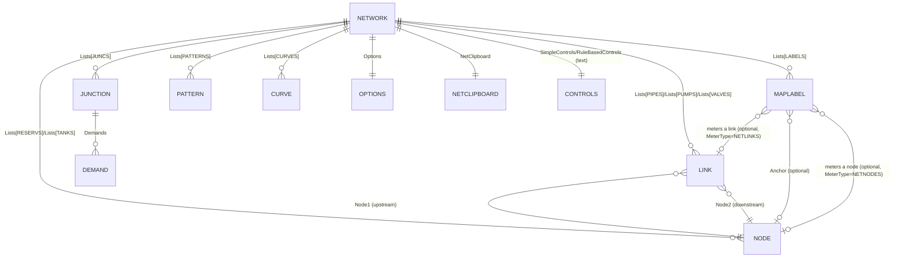

# Domain Model: EPANET Legacy User Interface (EPANET2W)

**Path analyzed:** . (repository root: C:\Learnings\Projects\EPANET-legacy-user-interface)
**Date analyzed:** 2026-07-23

## Entities

This is a Delphi 7 VCL desktop GUI (`epanet2w.exe`) for building and analyzing a pipe-network (water distribution system) model. Almost all domain entities are declared in `epanet2w/Uglobals.pas`; each was opened directly to confirm its field list (the collector's `type_declarations[]` only records name/kind/location for `class`/`record` entries, not fields).

- **TNetwork** (`epanet2w/Uglobals.pas:673`) — the in-memory model of one EPANET project. Fields confirmed by reading the class body: `Lists: array[JUNCS..OPTS] of TStringList` (one string list per object category — see Relationships), `PropList: TStringList` (working data for the Property Editor), `SimpleControls`/`RuleBasedControls: TStringList` (raw control-rule text), `Options: TOptions`, `NetClipboard: TNetClipboard`. Inference: this is the aggregate root for "the network being edited" — there is exactly one live instance, held in the unit-level global variable `Network: TNetwork` (Uglobals.pas line 806).

- **TNode** (`Uglobals.pas:569`) — base class for a network node. Fields: `ID: PChar`, `X, Y: Extended` (map coordinates), `Zindex` (index into computed-results arrays), `ColorIndex` (map display color), `Data: array[0..MAXNODEPROPS] of String` (generic property slots, addressed by the `*_INDEX` constants, e.g. `JUNC_ELEV_INDEX`, `RES_HEAD_INDEX`, `TANK_MAXLVL_INDEX`). Inference: reservoirs and tanks are represented as plain `TNode` instances distinguished only by which `Network.Lists[]` slot (`RESERVS` or `TANKS`) holds them and by which `*_INDEX` constants are used to interpret `Data[]` — there are no separate `TReservoir`/`TTank` Delphi classes, confirmed by `AddNode` in `Uinput.pas:315` which creates a plain `TNode.Create` for both reservoirs and tanks.

- **TJunc** (`Uglobals.pas:584`, subclass of `TNode`) — adds `Demands: TStringList`, one entry per demand category (confirmed by `AddDemand` in `Uinput.pas:304`, which appends a `#13`-delimited demand/pattern/category string). Inference: a junction is a network node with one or more independent water-demand categories (base demand + assigned time pattern + category label), edited via the Demand Editor (`Ddemand.pas`, confirmed by `EditDemands` in `Uinput.pas:527`).

- **TLink** (`Uglobals.pas:593`) — base class for a network link. Fields: `Node1, Node2: TNode` (the two end nodes — a hard structural fact, not inferred), `Vlist: PVertex` (linked list of interior vertex points for map drawing), `Zindex`, `ColorIndex`, `Data: array[0..MAXLINKPROPS] of String`. As with nodes, pipes/pumps/valves share this one class, distinguished only by which `Lists[]` slot (`PIPES`/`PUMPS`/`VALVES`) holds them (confirmed by `AddLink` in `Uinput.pas:243`, which builds one `TLink` and assigns default properties from `DefProp[PIPES|PUMPS|VALVES]` depending on `Ltype`).

- **TPattern** (`Uglobals.pas:609`) — `Comment: String`, `Multipliers: TStringList`. Inference: a named time-varying demand/head multiplier series shared by reference across junctions/reservoirs (`AddPattern`, `Uinput.pas:372`).

- **TCurve** (`Uglobals.pas:619`) — `Comment`, `Ctype: String`, `Xdata`/`Ydata: TStringList`. Inference: a named X-Y curve; `Ctype` (values seen as `VOLCURVE`/`HEADCURVE`/`EFFCURVE`/`HLOSSCURVE` constants in `Dcurve.pas:22-25`) distinguishes a tank volume curve, pump head curve, pump efficiency curve, or valve headloss curve — one curve *class* serving four distinct real-world roles depending on which object references its ID.

- **TMapLabel** (`Uglobals.pas:631`) — `X, Y: Extended`, `Anchor: TNode` (a real object reference, not a string), `MeterType: Integer`, `MeterId: String`, `MeterText`, font fields. Confirmed by `UpdateLabelAnchor` (`Uinput.pas:1644`) that `Anchor` must resolve to an existing node when set (blank = no anchor), and by `UpdateLabelMeter` (`Uinput.pas:1676`) that `MeterId` must resolve to an existing node or link of the type given by `MeterType` (`NETNODES`/`NETLINKS` constants). Inference: a map label is a free-floating annotation that can optionally be pinned to a node's position (Anchor) and can independently be wired to "meter" (display the live value of) any node or link on the map.

- **TOptions** (`Uglobals.pas:650`) — `Title: String`, `Notes: TStringList`, `Data: array[0..MAXOPTIONS] of String` (addressed by `*_INDEX` constants spanning hydraulics/quality/reactions/time/energy settings, e.g. `FLOW_UNITS_INDEX`, `TRIALS_INDEX`, `DURATION_INDEX`, `EFFIC_INDEX`). Inference: the single project-wide analysis configuration plus the project's title/notes metadata, held one-per-`TNetwork` (`Network.Options`, not a list).

- **TNetClipboard** (`Uglobals.pas:661`) — `ObjType: Integer`, `Data`/`Demands: TStringList`, `Font: TFont`. Inference: a single in-memory clipboard object (`Network.NetClipboard`) backing the Copy/Paste-object capability confirmed by `CopyNode`/`CopyLink`/`CopyLabel`/`PasteNode`/`PasteLink`/`PasteLabel` in `Uinput.pas` (lines 799-954).

- **Network Controls (Simple / Rule-Based)** — not a distinct Delphi class; stored as raw text in `Network.SimpleControls` and `Network.RuleBasedControls` (both `TStringList`). Confirmed by `EditControls` (`Uinput.pas:715`), which loads whichever list into a plain `Memo1` text box for free-form editing and writes it back verbatim on OK. Inference: EPANET2W treats "how the network is operated" (simple if-then rules and rule-based control blocks) as an opaque text-based mini-language passed through to the solver DLL, not as a structured, GUI-validated business object.

- **TCalibData** (`Uglobals.pas:465`) — `FileName: String`, `Locations: TStringList` (measurement-location IDs with an active/inactive flag, per `RegisterLocations` in `Ufileio.pas:776`), `MeasError: Integer`. Held as two fixed-size global arrays, `NodeCalibData: array[DEMAND..NODEQUAL] of TCalibData` and `LinkCalibData: array[FLOW..HEADLOSS] of TCalibData` (`Uglobals.pas:897-898`) — i.e., at most one registered calibration dataset per measured variable type, not attached to `TNetwork` itself. Inference: this backs the model-calibration capability (comparing simulated results against field measurements), one dataset per variable (e.g. one file of measured pressures, a separate file of measured flows).

Entities considered and dropped as non-domain: `TPropRecord`/`TEditStyle`/`TEditMask` (`PropEdit.pas`) are generic property-grid rendering metadata, not network concepts; `TLinkInfo` (`Fmap.pas:61`, confirmed by reading — "Data structure for drawing a link", holding only pixel coordinates) is a map-rendering cache, not a domain entity.

## Relationships

- `NETWORK ||--o{ ...`: every collection relationship above is grounded in `TNetwork.Lists: array[JUNCS..OPTS] of TStringList` (`Uglobals.pas:674`) plus the `AddNode`/`AddLink`/`AddLabel`/`AddPattern`/`AddCurve` procedures in `Uinput.pas`, each of which calls `Network.Lists[<category>].AddObject(id, anObject)`. JUNCTION is modeled separately from the generic NODE box because it is a distinct Delphi class (`TJunc`); RESERVS and TANKS are plain `TNode` rows in the same diagram box labeled NODE since no distinct classes exist for them (see Entities).
- `LINK }o--|| NODE` (twice, for Node1/Node2): grounded directly in the `TLink` field declaration (`Node1, Node2: TNode` — two single-object fields, not lists), and in the business rule enforced by `UpdateLinkNode` (`Uinput.pas:1591`) that a link's two end-node references must both resolve to real, distinct nodes.
- `JUNCTION ||--o{ DEMAND`: grounded in `TJunc.Demands: TStringList` and `AddDemand` (`Uinput.pas:304`).
- `MAPLABEL` relationships: grounded in the `Anchor: TNode` field plus `UpdateLabelAnchor`/`UpdateLabelMeter` logic described under Entities. The "meters" relationship is deliberately shown as two separate optional lines (to NODE and to LINK) because `TMapLabel` stores only a `MeterId: String` plus a `MeterType` discriminator rather than a single strongly-typed reference — the collector/registration code resolves which one it means at edit time, not at the type level, so no single cardinality claim was safe to make about a fixed target type.
- Cardinality choices follow the rule of "don't assert more than the code states": `NETWORK ||--|| OPTIONS` and `NETWORK ||--|| NETCLIPBOARD` are one-to-one because `TNetwork` holds them as single fields, not list entries; the `NETWORK ||--o{` collection relationships are one-to-many because they are held in `TStringList`s that can hold zero or more entries; `LINK }o--||` is many-to-one because many links may reference the same node (no code-level cap on how many links a given node may terminate), while each link has exactly one `Node1` and one `Node2`.
- `TCalibData` is deliberately **not** placed in the diagram: its `Locations: TStringList` holds bare ID strings, not object references, and it is held in per-variable-type global arrays (`NodeCalibData`, `LinkCalibData`, `Uglobals.pas:897-898`) rather than owned by `TNetwork`, so no safe structural cardinality to NODE/LINK/NETWORK could be confirmed from the code read during this analysis. This is called out as a Named Gap in the functional spec.
- `Controls` (Simple/Rule-Based) is shown as a 1:1 "has" relationship to NETWORK because it's stored as two fixed string-list fields directly on `TNetwork`, not because the rules themselves reference nodes/links in a way this analysis parsed — the rule text itself (e.g. "LINK P1 OPEN IF NODE N1 ABOVE 10") is opaque to the GUI (see Entities), so no relationship line to JUNCTION/LINK is drawn for it.

## Business Rules

Each rule below is anchored to a `validation_routine_candidates[]` entry (read in full) or to a related routine opened directly for context. Candidates judged not to state a real business rule were dropped: `CancelBtnClick` (`Dbackdim.pas:153`, `Fsimul.pas:125`) are plain Cancel-button/OnClick handlers matched only because their names start with "Can"; `CheckFramedClick` (`Dlegend.pas:436`) merely sets a `Modified` flag. `ValidateInput` (`Uinput.pas:1196`) is not itself a rule — it is a dispatcher that routes to the per-object-type `Valid*` functions below by `EditorObject`.

1. **Unique node ID.** A junction/reservoir/tank ID cannot duplicate another node's ID. `DupNodeID` (`Uinput.pas:2150`) blanks the current row's ID, searches for a node already using the proposed ID via `FindNode`, and — if found — restores the old ID and rejects the change with `FMT_NODE_EXISTS = 'Node %s already exists.'`.
2. **Unique link ID.** Same rule for pipes/pumps/valves. `DupLinkID` (`Uinput.pas:2186`) performs the identical blank-search-restore pattern against `FindLink`, rejecting with `FMT_LINK_EXISTS`.
3. **Unique pattern/curve ID.** `DupID` (`Uinput.pas:2214`) applies the same duplicate-ID check to the current pattern or curve list (`Network.Lists[CurrentList]`), rejecting with `MSG_ALREADY_HAVE`.
4. **A link cannot connect a node to itself, and both endpoints must exist.** `UpdateLinkNode` (`Uinput.pas:1591`) first requires the new endpoint name to resolve via `FindNode` (else `TXT_NO_NODE_NAMED`), then explicitly rejects the change if the new node would equal the link's *other* endpoint (`TXT_BAD_CONNECTION = 'Node cannot be connected to itself.'`).
5. **Node coordinates must be valid numbers.** `UpdateXY` (`Uinput.pas:1559`) rejects a map-position edit if the entered string doesn't parse via `Uutils.GetExtended`, with error text `'<value>' is not a valid number.'`.
6. **Numeric property fields must be valid single-precision numbers.** `ValidJunc`, `ValidReserv`, `ValidTank`, `ValidPipe`, `ValidPump`, `ValidValve` (`Uinput.pas:1217-1415`) each validate their numeric fields (elevation, demand, head, tank levels/diameter/volume, pipe length/diameter/roughness, pump power/speed, valve diameter/minor-loss, etc.) via `Uutils.GetSingle`, returning `False` (rejecting the edit) on failure. Several fields are explicitly optional — validated only `if (Length(Trim(S)) > 0)` — e.g. junction/reservoir/tank Init. Quality, pipe/pump/tank bulk & wall reaction coefficients, pump energy price: these may be left blank.
7. **Analysis-option time values cannot be negative.** `ValidOption` (`Uinput.pas:1478`) rejects any Times-tab entry (duration, hydraulic/quality/pattern/report time steps, start times — `k` between `DURATION_INDEX` and `RPT_START_INDEX`) whose parsed value via `Uutils.StrHoursToFloat` is `< 0`. Mechanically: rejects negative time values; the code does not further explain why (evident from domain: a negative duration/time-step is meaningless).
8. **Blank Defaults-dialog hydraulics entries fall back to the factory default.** `ValidateOption` (`Ddefault.pas:295`) — if the user leaves a Hydraulics-tab default field blank (`Length(S) = 0`), the value is silently replaced with `DefOptions[Index]` rather than rejected. Mechanically: blank input on this one tab is auto-filled rather than treated as invalid.
9. **A map label's anchor node, if set, must reference an existing node.** `UpdateLabelAnchor` (`Uinput.pas:1644`) requires `FindNode` to succeed for a non-blank anchor ID, else rejects with `TXT_NO_NODE`; blank clears the anchor.
10. **A map label's "meter" reference, if set, must reference an existing node or link matching its declared meter type.** `UpdateLabelMeter` (`Uinput.pas:1676`) checks `FindNode` (if `MeterType = NETNODES`) or `FindLink` (if `NETLINKS`), rejecting with `TXT_NO_NODE`/`TXT_NO_LINK` on failure.
11. **Deleting a node cascades to its connected links and label references, and always asks for confirmation.** `GroupDelete` (`Uinput.pas:1125`) — invoked for a fence-region ("group") delete from the Browser's Delete button (`Fbrowser.pas:259` `BtnDeleteClick`, confirmed by `Uinput.GroupDelete` call at line 273) — first shows `MSG_CONFIRM_DELETE = 'Are you sure that you want to delete all objects in the selected region?'`; on confirmation, for every node inside the selected region it also deletes every pipe/pump/valve attached to that node (`DeleteNetworkObject(k,m)` for any link whose `Node1`/`Node2` equals the node) and clears any map-label anchor/meter references to it (`DeleteLabelAnchor`, `DeleteLabelMeter`) before deleting the node itself.
12. **A curve's X-values must be strictly ascending, and its ID must be unique.** `TCurveForm.CanClose` (`Dcurve.pas:139`, found by direct reading — matches the `Can*` naming pattern but was not present in the collector's `validation_routine_candidates[]`) blocks the Curve Editor from closing if `DupID` reports a duplicate curve ID, or if any X-value is `<=` the previous one (`MSG_OUT_OF_ORDER = ' values are not in ascending order.'`).
13. **A "PUMP"-type curve with exactly 1 or 3 data points is checked for a valid power-curve fit, but the user may proceed anyway.** Also in `TCurveForm.CanClose`: if `FitPumpCurve` fails for a 1- or 3-point pump curve, the user is warned (`MSG_BAD_CURVE = 'Illegal pump curve. Continue editing?'`) but may answer "No" to save it regardless — this is a soft warning, not a hard rejection.
14. **Map lower-left and upper-right corners must differ in both X and Y.** `TMapDimensionsForm.BtnOKClick` (`Dmapdim.pas:116`) rejects the dialog's OK action with `MSG_ILLEGAL_MAP_LIMITS = 'Illegal map limits.'` if `x1 = x2` or `y1 = y2`, i.e. a zero-width or zero-height map bounding box is not allowed.
15. **Table filters are capped at 10.** `TTableOptionsForm.FilterAddBtnClick` (`Dtable.pas:489`) refuses to add another filter once `NextFilter > MAXFILTERS` (`MAXFILTERS = 10`, `Uglobals.pas:78`), showing `MSG_FILTER_LIMIT`.
16. **A results file must carry the expected magic number, at least one saved time period, and a compatible version to be treated as a successful run.** `CheckRunStatus` (`Uoutput.pas:136`) reads a magic number and version stamped at both the start and end of the binary results file: mismatched magic number ⇒ `rsError`; zero or negative saved time periods ⇒ `rsError`; version outside the expected value ⇒ `rsWrongVersion`; a non-zero warning flag ⇒ `rsWarning`; otherwise `rsSuccess`.
17. **A project (.NET) file must start with the `<EPANET2>` marker and carry a version ID between 20005 and 20008.** `ReadNetFile` (`Ufileio.pas`, read directly around line 440-452) raises a read error if the first string in the file isn't `'<EPANET2>'` or if the stored `Version` falls outside `[VERSIONID1, VERSIONID2] = [20005, 20008]` (`Uglobals.pas:60-61`); `OpenProject` (`Ufileio.pas:721`) then falls back to attempting a `.INP` text-format import if the binary read fails this or any other way.
18. **A file path is only treated as valid if the OS reports real attributes for it.** `ValidFile` (`components/OpenDlg.pas:169` and, separately, `epanet2w/Umap.pas:186`) is a simple existence check — `GetFileAttributes(...) <> $FFFFFFFF` — used to gate the Open-File preview pane and the map backdrop image loader respectively. Mechanically: checks the file exists/is accessible; reason not further explained in either call site.

## Enumerations

Every `type_declarations[]` entry with `kind: "enum"` is listed below with its full, collector-captured value list. Meaning lines are prefixed `Inference:` per the Domain Inference Rule.

- **TUnitSystem** `(usUS, usSI)` — `epanet2w/Uglobals.pas:45`. Inference: the measurement-unit system the whole project is displayed/entered in — US customary vs. SI metric.
- **TVariableSource** `(vsInput, vsOutput)` — `Uglobals.pas:46`. Inference: whether a displayed node/link variable (e.g. Elevation vs. Pressure) originates from user-entered input data or from simulation output results; used throughout `Uinput.pas`/`Uoutput.pas` to decide when map colors need recomputing after an edit.
- **TRunStatus** `(rsSuccess, rsWarning, rsError, rsWrongVersion, rsFailed, rsShutdown, rsCancelled, rsNone)` — `Uglobals.pas:47`. Inference: the outcome lifecycle of one hydraulic/water-quality simulation run, confirmed end-to-end by reading `Fsimul.pas`'s `DisplayRunStatus` and `Uoutput.pas`'s `CheckRunStatus` (Business Rule 16) — `rsShutdown`/`rsCancelled` mean the run was aborted before completion (solver crash vs. user Cancel), `rsFailed` means no report was produced at all, `rsWrongVersion`/`rsError` mean the results file didn't validate, `rsWarning` means it completed with solver warnings, `rsSuccess` is the clean-completion case.
- **TContourStyle** `(csFilled, csLines)` — `Uglobals.pas:49`. Inference: how a contour plot of a node/link variable over the map is rendered — filled color bands vs. contour lines.
- **TArrowStyle** `(asNone, asOpen, asFilled, asFancy)` — `Uglobals.pas:50`. Inference: the flow-direction arrow glyph style drawn on pipes on the network map.
- **TWaterQuality** `(wqNone, wqChem, wqTrace, wqAge)` — `Uglobals.pas:51`. Inference: the type of water-quality analysis configured for the project — none, a chemical/constituent concentration simulation, a source-tracing simulation, or a water-age simulation; this is a first-class analysis mode alongside pure hydraulics (consistent with the prior codebase report's finding that WQ modeling is a first-class EPANET feature).
- **TMapUnits** `(muFeet, muMeters, muDegrees, muNone)` — `Uglobals.pas:52`. Inference: the real-world length unit the network map's coordinate system is calibrated to (including a geographic lat/long option).
- **TInputFileType** `(iftNone, iftNET, iftINP)` — `Uglobals.pas:53`. Inference: which of the two supported project-file formats (native binary `.NET` project file vs. plain-text EPANET `.INP` input file) is currently loaded, or neither for a brand-new/unsaved project — confirmed directly by `OpenProject`'s branching logic (Business Rule 17).
- **TFileType** `(ftInput, ftImport)` — `epanet2w/Uimport.pas:144`. Inference: distinguishes whether a text file is being read as the project's primary input file vs. as a supplementary "import" (e.g. a scenario/map file merged into the current project).
- **TLinkSymbol** `(lsArrow, lsPump, lsValve, lsCheckValve)` — `epanet2w/Umap.pas:30`. Inference: which map glyph is drawn for a given link — a plain directional arrow for ordinary pipes, or a distinct pump/valve/check-valve symbol.
- **TRelationType** `(rtBelow, rtEquals, rtAbove)` — `epanet2w/Uutils.pas:29`. Inference: the relational operator available when the user defines a query or table filter condition on a network variable (confirmed by `TFilter.Relation: TRelationType` and by the Query dialog's own framing in `epanet2w/README.md`, "find all nodes with pressure below 20 psi") — i.e. "below", "equal to", or "above" a threshold value.
- **TEditStyle** `(esReadOnly, esEdit, esComboList, esComboEdit, esButton)` — `epanet2w/PropEdit.pas:54`. Inference: this is a UI-component-level enum (how one row of the generic Property Editor grid should render/behave) rather than a network-domain concept.
- **TEditMask** `(emNone, emNumber, emPosNumber, emNoSpace)` — `epanet2w/PropEdit.pas:57`. Inference: UI-component-level input-restriction mode for a Property Editor field, not a domain concept.
- **TSeriesType** `(stLine, stFastLine, stPoint, stBar, stHorizBar, stArea, stPie)` — `components/CDForm.pas:45`. Inference: a chart-component rendering style (TeeChart series type), not a domain concept.
- **TPageType** `(General, HorizAxis, VertAxis, Legend, Series)` — `components/ChartDlg.pas:24`. Inference: identifies which tab of the reusable Chart Options dialog is active; a UI-component concept, not domain.
- **TSortBy** `(ccsUnsorted, ccsColor, ccsText)` — `components/ComboColor.pas:16`. Inference: sort order for the reusable color-picker combo-box component; not domain.
- **TEditStyle** `(esNone, esNumber, esPosNumber, esNoSpace)` — `components/NumEdit.pas:28`. Inference: input-restriction style for the reusable numeric edit-box component; not domain (distinct declaration from the same-named `PropEdit.pas` enum above — two components independently define the same enum name).
- **TMeasurements** `(pmDefault, pmMillimeters, pmInches)` — `components/PgSetup.pas:49`. Inference: measurement unit for the reusable Page Setup dialog component; not domain.
- **TPageNumbers** `(pnNone, pnUpperLeft, pnUpperCenter, pnUpperRight, pnLowerLeft, pnLowerCenter, pnLowerRight)` — `components/PgSetup.pas:50`. Inference: page-number placement option for the reusable Page Setup/printing component; not domain.
- **TDestination** `(dPrinter, dPreview)` — `components/Xprinter.pas:40`. Inference: whether the reusable print-control component sends output to the physical printer or to an on-screen preview; not domain.
- **TJustify** `(jLeft, jRight, jCenter)` — `components/Xprinter.pas:41`. Inference: text justification for the reusable print-control component; not domain.
- **TUnits** `(uInches, uMM)` — `components/Xprinter.pas:43`. Inference: measurement unit for the reusable print-control component; not domain.
