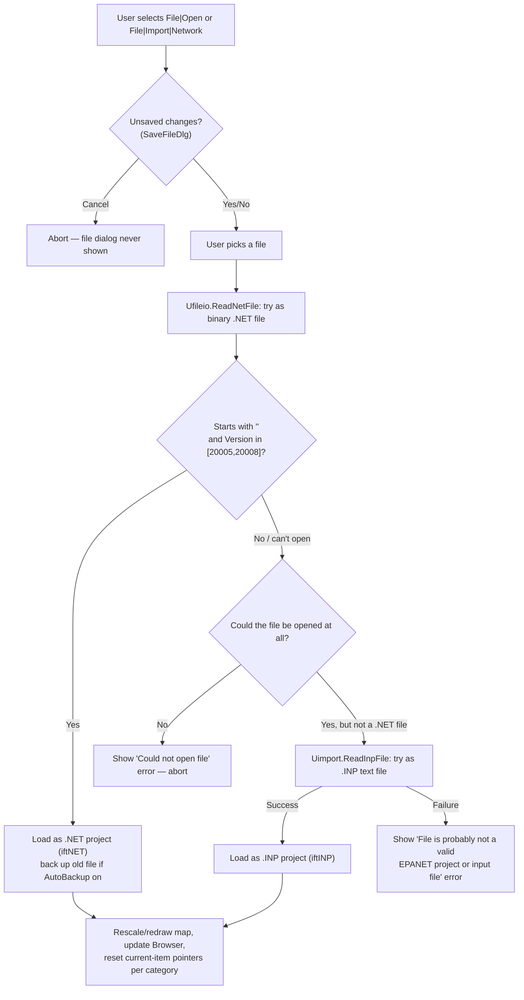
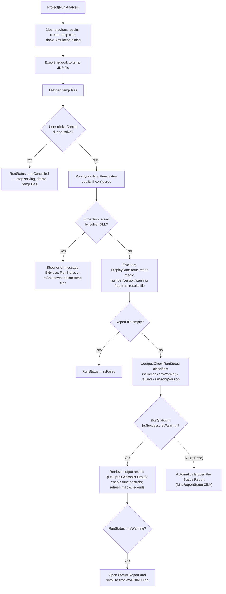
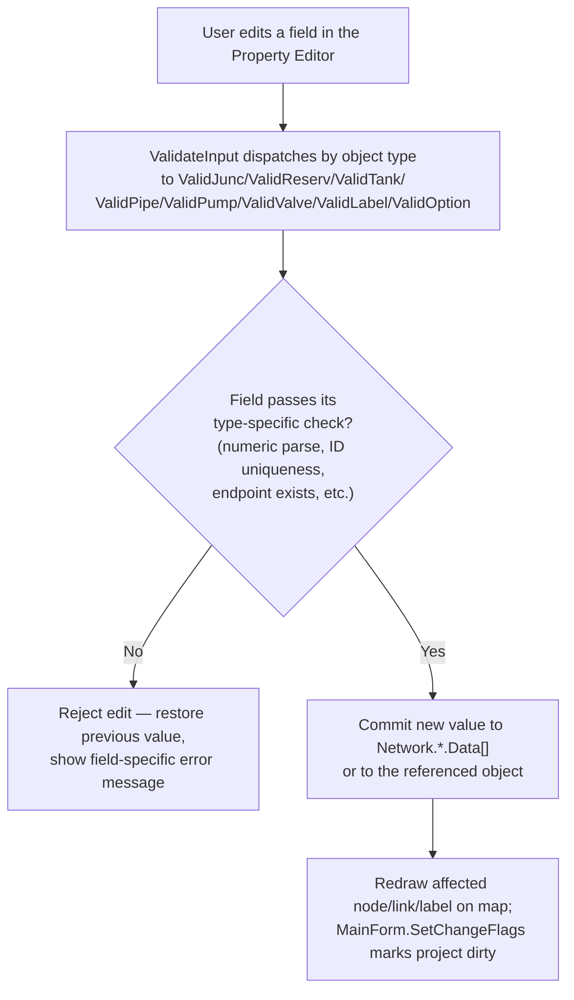
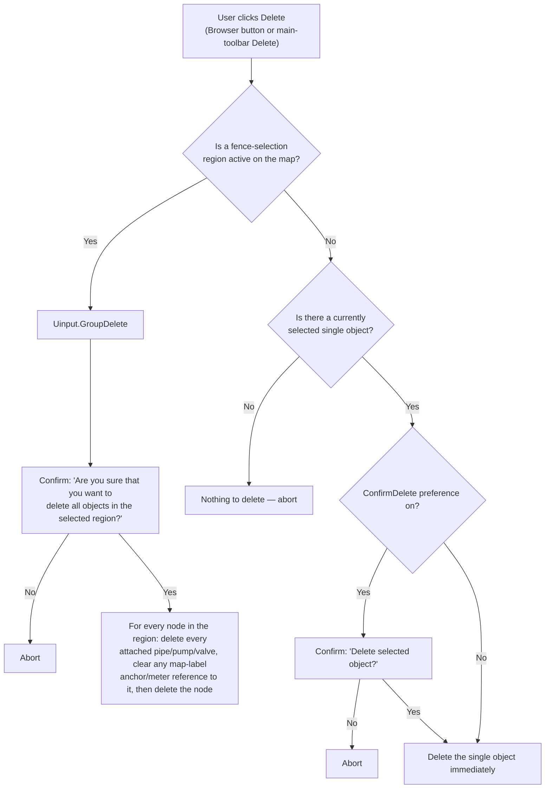

# Functional Spec: EPANET Legacy User Interface (EPANET2W)

**Path analyzed:** . (repository root: C:\Learnings\Projects\EPANET-legacy-user-interface)
**Date analyzed:** 2026-07-23

## Capabilities

`forms[]` shows that 42 of the app's 45 `.dfm` files are in binary (non-parseable) format, so control captions could not be read from the DFMs themselves for most forms (see UI Inventory and Named Gaps). Capabilities below are instead grounded directly in the menu-handler procedures and their own header comments in `epanet2w/Fmain.pas` (each comment states the menu path verbatim, e.g. "when File|New selected from main menu"), in the `Edit*`/`Add*` procedures of `epanet2w/Uinput.pas`, in `epanet2w/Fbrowser.pas`, and in `epanet2w/README.md`.

**File menu** (`Fmain.pas` lines 565-928):
- New Project — `MnuNewClick`
- Open Project — `MnuOpenClick`
- Save — `MnuSaveClick`
- Save As — `MnuSaveAsClick`
- Import Scenario (.scn) — `MnuImportScenarioClick`
- Import Map (.map) — `MnuImportMapClick`
- Import Network (.inp) — `MnuImportNetworkClick`
- Export Scenario — `MnuExportScenarioClick` (opens `TDataExportForm`)
- Export Map (metafile/DXF) — `MnuExportMapClick` (opens `TMapExportForm`)
- Export Network (.inp) — `MnuExportNetworkClick`
- Page Setup — `MnuPageSetupClick`
- Print Preview / Print — `MnuPrintPreviewClick` / `MnuPrintClick`
- Preferences — `MnuPreferencesClick` (opens `TPreferencesForm`)
- Exit — `MnuExitClick`
- Most-Recently-Used file list — `MRUDisplay`/`MRUClick` (rebuilt every time the File menu is opened, per `MnuFileClick`)

**Edit menu** (`Fmain.pas` lines 929-1029):
- Copy active window to clipboard — `MnuCopyClick` (delegates to the active MDI child's own `CopyTo`, confirmed for Map/Graph/Table/Contour/Status/CalibReport/Energy forms)
- Select Object / Select Vertex / Select Region / Select All (map interaction modes) — `MnuSelectObjectClick`, `MnuSelectVertexClick`, `MnuSelectRegionClick`, `MnuSelectAllClick`
- Group Edit (bulk-modify a property for every junction/pipe inside a fenced map region) — `MnuGroupEditClick`, backed by `Uinput.GroupEdit`

**View menu** (`Fmain.pas` lines 1036-1263):
- Set Map Dimensions — `MnuDimensionsClick`
- Backdrop image: Load / Unload / Align / Show-Hide — `MnuBackdropLoadClick`/`UnloadClick`/`AlignClick`/`ShowClick`
- Map actions: Full Extent, Pan, Zoom In, Zoom Out — `MapActionClick`
- Map Options — `MnuViewOptionsClick`
- Find object by ID — `MnuFindClick` ("Activates the Find dialog to locate an object on the map when View|Find selected")
- Query (highlight map objects meeting a criterion, e.g. "pressure below 20 psi") — `MnuQueryClick`
- Overview Map toggle — `MnuOVMapClick`
- Legends: toggle Node/Link/Time legend, modify Node/Link legend — `MnuLinkLegendClick`, `MnuNodeLegendClick`, `MnuTimeLegendClick`, `MnuModifyNodeLegendClick`, `MnuModifyLinkLegendClick`
- Toolbar visibility toggles — `MnuStdToolbarClick`, `MnuMapToolbarClick`

**Project menu** (`Fmain.pas` lines 1310-1374):
- Project Defaults — `MnuProjectDefaultsClick` (opens `TDefaultsForm`)
- Project Summary (title/notes/component counts) — `MnuProjectSummaryClick`
- Register Calibration Data — `MnuProjectCalibDataClick`
- Analysis Options (Property Editor shows Hydraulics/Quality/Reactions/Time/Energy categories) — `MnuAnalysisOptionsClick`
- Run Analysis — `MnuProjectRunAnalysisClick` → `RunSimulation` (see Workflows)

**Report menu** (`Fmain.pas` lines 1382-1574):
- Status Report — `MnuReportStatusClick` (enabled only after a run)
- Energy Report — `MnuReportEnergyClick` (disabled if the network has no pumps: `MSG_NO_PUMPS`)
- Reaction Report — `MnuReportReactionClick` (enabled only for a chemical-quality run, `QualFlag = 1`)
- Calibration Report — `MnuReportCalibrationClick` (disabled if no calibration data registered: `MSG_NO_CALIB_DATA`)
- Full Report to file — `MnuReportFullClick` → `Ureport.CreateFullReport`
- Graph (time series / profile / frequency / system-flow / reaction-rate plots) — `MnuGraphClick`
- Table (tabular node/link values) — `MnuTableClick`
- Report Options (context-sensitive: only enabled for a Graph/Contour/Table/CalibReport child window) — `MnuReportOptionsClick`

**Window / Help menus**: Arrange, Close All (`MnuArrangeClick`, `MnuCloseAllClick`); About, Help Topics, Units help, What's New, Tutorial (`MnuAboutClick`, `MnuHelpTopicsClick`, `MnuHelpUnitsClick`, `MnuHelpWhatsNewClick`, `MnuHelpTutorialClick`).

**Data Browser panel** (`epanet2w/Fbrowser.pas`, per `epanet2w/README.md`: "navigate through the pipe network database and control what information is viewed"):
- Add a new network object (junction/reservoir/tank/pipe/pump/valve/label) by selecting the matching Map-toolbar "add" tool then clicking the map — grounded in `TMainForm.ToolButton1Click`'s own tag-to-action comment table (`Fmain.pas:1705-1719`, tags 6-12 = "Activate Add Object tool") and `TMapForm.ToolButtonClick` (`Fmap.pas:720`) setting `CurrentTool` to the chosen object-type constant, feeding `Uinput.AddNode`/`AddLink`/`AddLabel`.
- Edit the currently-selected object's properties in the Property Editor — `Uinput.UpdateEditor`/`EditNode`/`EditLink`/`EditOptions`
- Edit a junction's demand categories — `Uinput.EditDemands` (opens `TDemandsForm`)
- Edit a node's water-quality source — `Uinput.EditSource` (opens `TSourceForm`)
- Edit a time pattern / X-Y curve — `Uinput.EditPattern` / `Uinput.EditCurve`
- Edit Simple Controls / Rule-Based Controls (free-text rule editor) — `Uinput.EditControls`
- Delete the selected object, or every object inside a fenced map region — `TBrowserForm.BtnDeleteClick` (`Fbrowser.pas:259`), mirrored by the main-toolbar Delete button (`TMainForm.TBDeleteClick`, `Fmain.pas:1685`, explicitly commented "same as clicking Browser's Delete button")
- Copy / Paste a node, link, or label via the network clipboard — `Uinput.CopyNode`/`CopyLink`/`CopyLabel`/`PasteNode`/`PasteLink`/`PasteLabel`

## Workflows

### Open a Project

Triggered by File|Open (`MnuOpenClick`) or File|Import|Network (`MnuImportNetworkClick`), both funneling into `TMainForm.OpenFile` (`Fmain.pas:1882`) → `Ufileio.OpenProject` (`Ufileio.pas:721`). This workflow branches on file format and is grounded end-to-end in the opened source:

### Start a New Project

File|New (`MnuNewClick`, `Fmain.pas:591`) — prompts to save unsaved changes first (`SaveFileDlg`); if not cancelled, closes all output-display MDI children (`CloseForms`), resets the input-file name/type, clears the entire in-memory `Network` (`ClearAll`), resets the page layout, and makes Junctions the Browser's current category. Linear once past the initial save-prompt branch (same branch shape as the "Open a Project" diagram's first two steps).

### Save a Project

File|Save (`MnuSaveClick`, `Fmain.pas:648`) redirects to Save As if the project has never been named or was opened as a plain `.INP` file (`InputFileType = iftINP`); otherwise it calls `SaveFile` on the existing file name directly. `SaveFile` (`Fmain.pas:1978`) itself refuses to overwrite a file marked read-only (shows `MSG_READONLY` instead of writing), and on success clears the "unsaved changes" flag (`HasChanged := False`) and updates the window caption and MRU list.

### Run Hydraulic & Water-Quality Analysis

Project|Run Analysis (`MnuProjectRunAnalysisClick`) → `TMainForm.RunSimulation` (`Fmain.pas:2360`) → `TSimulationForm.Execute` (`Fsimul.pas:134`), which exports the current in-memory network to a temporary `.INP` file, then drives the EPANET2.DLL solver through `ENopen`/hydraulics/quality/`ENclose`, and finally classifies the outcome via `Uoutput.CheckRunStatus` reading the binary results file (Business Rule 16 in the domain model). This workflow branches heavily on outcome:

### Edit a Network Object's Properties

Selecting a node/link/label/options category in the Browser (or on the map) calls `Uinput.UpdateEditor` (`Uinput.pas:388`), which loads the object's current values into the shared Property Editor (`Fproped.pas`) via `EditNode`/`EditLink`/`EditLabel`/`EditOptions`. Editing a field routes through `ValidateInput` → the per-category `Valid*` function (Business Rules 1-10 in the domain model):

### Delete Object(s)

`TBrowserForm.BtnDeleteClick` (`Fbrowser.pas:259`) branches on whether the user has drawn a fence-selection region on the map:

### Edit an X-Y Curve

`Uinput.EditCurve` opens `TCurveForm` (`Dcurve.pas`); on close, `TCurveForm.CanClose` (`Dcurve.pas:139`) enforces curve-specific business rules 12-13 from the domain model (unique ID, ascending X-values, and — for a 1- or 3-point "PUMP" curve — a soft warning if the internal pump-curve equation fit fails, which the user may override).

### Generate a Report

Report-menu items are gated by simulation state, checked every time the Report menu is opened (`MnuReportClick`, `Fmain.pas:1382`): Status/Energy/Reaction/Calibration/Full report items are only enabled once a run has completed (`RunFlag`/`RunStatus`), Energy specifically requires the network to contain at least one pump (else `MSG_NO_PUMPS`), Reaction specifically requires a chemical water-quality run (`QualFlag = 1`), and Calibration specifically requires at least one previously-registered calibration dataset (else `MSG_NO_CALIB_DATA`). Once enabled, each report item opens its own MDI child form (`TStatusForm`, `TEnergyForm`, `TGraphForm`, `TCalibReportForm`, `TTableForm`) or, for Full Report, writes directly to a text file via `Ureport.CreateFullReport`.

## UI Inventory

`xaml_forms[]` and `other_ui_files[]` are both empty in the collected facts — expected and not a gap, since this is a pure Delphi 7 VCL desktop application with no XAML or web-view UI surface. All UI is defined in the 45 `.dfm` files below (44 covering `epanet2w/` + `components/`, one of which — `Dsource1.dfm` — is not referenced by the project's own `.dpr` build; see Named Gaps).

**Parseable forms** (text-format `.dfm`, controls/handlers fully captured):
| Form file | Root class | Controls | Handlers |
|---|---|---|---|
| `components/CDForm.dfm` | `TChartOptionsForm` ("Chart Options") | 7 | 9 |
| `epanet2w/Dbackdim.dfm` | `TBackdropDimensionsForm` ("Backdrop Dimensions") | 8 | 12 |
| `epanet2w/Dbackdrp.dfm` | `TBackdropFileForm` ("Backdrop Image Selector") | 10 | 7 |

**Non-parseable forms** (binary-format `.dfm` — reason recorded by the collector as "binary DFM format (or unrecognized text structure)"; class name from `type_declarations[]`, one-line purpose from `epanet2w/README.md` / `components/README.md` where documented there):
| Form file | Root class (from `type_declarations[]`) | Documented purpose |
|---|---|---|
| `components/PSForm.dfm` | `TPageSetupForm` | Page Setup dialog component (printer, orientation, margins, headers/footers) |
| `components/XPForm.dfm` | `TProgressForm` | Print-progress dialog for the reusable Print Control component |
| `components/Xprinter.dfm` | `TPreviewForm` | Print-preview window for the reusable Print Control component |
| `epanet2w/Dabout.dfm` | `TAboutBoxForm` | About dialog box for EPANET2W |
| `epanet2w/Dcalib1.dfm` | `TCalibDataForm` | Registers calibration data files with the project |
| `epanet2w/Dcalib2.dfm` | `TCalibOptionsForm` | Selects parameter/locations for a Calibration Report |
| `epanet2w/Dcolramp.dfm` | `TColorRampForm` | Selects a map color scheme |
| `epanet2w/Dcontour.dfm` | `TContourOptionsForm` | Selects contour map display options |
| `epanet2w/Dcontrol.dfm` | `TControlsForm` | Edits Simple Controls or Rule-Based Controls (free text) |
| `epanet2w/Dcopy.dfm` | `TCopyToForm` | Selects format/destination for copying the current view |
| `epanet2w/Dcurve.dfm` | `TCurveForm` | Edits the X-Y values of a curve (pump/tank/pump-efficiency/valve) |
| `epanet2w/Ddataexp.dfm` | `TDataExportForm` | Selects database scenarios to save to file |
| `epanet2w/Ddefault.dfm` | `TDefaultsForm` | Selects default property/option settings for the project |
| `epanet2w/Ddemand.dfm` | `TDemandsForm` | Edits a junction's multiple demand categories |
| `epanet2w/Dfind.dfm` | `TFindForm` | Locates a node/link on the map by ID |
| `epanet2w/Dgraph.dfm` | `TGraphSelectForm` | Selects display/format options for an X-Y graph |
| `epanet2w/Dgrouped.dfm` | `TGroupEditForm` | Modifies a design parameter for a group of selected objects |
| `epanet2w/Dinperr.dfm` | `TInpErrForm` | Lists error messages from an import operation |
| `epanet2w/Dlabel.dfm` | `TLabelForm` | Inserts a text label on the network map |
| `epanet2w/Dlegend.dfm` | `TLegendForm` | Selects colors/ranges for the map legend |
| `epanet2w/Dmap.dfm` | `TMapOptionsForm` | Selects map display options |
| `epanet2w/Dmapdim.dfm` | `TMapDimensionsForm` | Sets the real-world dimensions of the network map |
| `epanet2w/Dmapexp.dfm` | `TMapExportForm` | Selects the file format for exporting the network map |
| `epanet2w/Dpattern.dfm` | `TPatternForm` | Edits the multipliers comprising a time pattern |
| `epanet2w/Dprefers.dfm` | `TPreferencesForm` | Sets program preferences |
| `epanet2w/Dquery.dfm` | `TQueryForm` | Defines a condition to highlight on the network map |
| `epanet2w/Dsource.dfm` | `TSourceForm` (`Dsource.pas`) | Edits a node's water-quality source (Concentration/Mass/Setpoint/Flow-Paced Booster) |
| `epanet2w/Dsource1.dfm` | `TSourceForm` (`Dsource1.pas`) | Duplicate Source-editor form — **not referenced by `Epanet2w.dpr`**; see Named Gaps |
| `epanet2w/Dtable.dfm` | `TTableOptionsForm` | Selects options for a design/computed-value table |
| `epanet2w/Fbrowser.dfm` | `TBrowserForm` | Navigates the network database; drives map color-coding |
| `epanet2w/Fcalib.dfm` | `TCalibReportForm` | Compares simulated vs. measured values (tabular/graphical) |
| `epanet2w/Fcontour.dfm` | `TContourForm` | Displays a contour plot of a design/computed parameter |
| `epanet2w/Fenergy.dfm` | `TEnergyForm` | Displays a table of pumping energy utilization |
| `epanet2w/Fgraph.dfm` | `TGraphForm` | Displays design/computed values via X-Y plots |
| `epanet2w/Fmain.dfm` | `TMainForm` | MDI parent form; Main Menu and Toolbars (`main_form_hint` confirms `TMainForm` as the application's entry-point form) |
| `epanet2w/Fmap.dfm` | `TMapForm` | Editable schematic of the pipe network |
| `epanet2w/Fovmap.dfm` | `TOVMapForm` | Shows the map's current view extent on an outline map |
| `epanet2w/Fproped.dfm` | `TPropEditForm` | Lists/edits properties of the currently selected component |
| `epanet2w/Fsimul.dfm` | `TSimulationForm` | Shows progress of an in-flight simulation run |
| `epanet2w/Fstatus.dfm` | `TStatusForm` | Displays the status report for the most recent run |
| `epanet2w/Fsummary.dfm` | `TSummaryForm` | Editable project title/notes; component-count summary |
| `epanet2w/Ftable.dfm` | `TTableForm` | Tabular view of design/computed network parameters |

## Named Gaps

- **42 of 45 `.dfm` files are binary-format and were not deep-parsed.** Only `CDForm.dfm`, `Dbackdim.dfm`, and `Dbackdrp.dfm` yielded real control/handler lists. For every other form (including the main form `Fmain.dfm` itself), captions, exact control layout, and DFM-to-code control bindings could not be confirmed from the `.dfm` directly — the Capabilities and Workflows sections above instead rely on the `.pas` code-behind's own procedure names and header comments, which is a weaker form of evidence than a parsed DFM would provide.
- **Only 21 of the application's ~90+ `TMainForm` menu/toolbar `OnClick` handlers appear in `handler_implementations[]`**, and all 21 belong to the three parseable forms plus shared component units (`components/CDForm.pas`, `epanet2w/Dbackdim.pas`, `epanet2w/Dbackdrp.pas`, `components/PSForm.pas`, `components/Xprinter.pas`). The much larger set of `Mnu*Click`/`TB*Click` handlers in `Fmain.pas` were read and used for grounding in this analysis, but because `Fmain.dfm` itself is non-parseable, the collector could not formally link those handler names back to a specific menu-item control/caption — this analysis instead trusts each handler's own header comment (which states its menu path in prose).
- **`Dsource1.pas`/`Dsource1.dfm` appear to be dead code.** Both declare a `TSourceForm` class (distinct from, and apparently superseded by, `Dsource.pas`'s own `TSourceForm`), but `epanet2w/Epanet2w.dpr`'s `uses` clause does not list `Dsource1` at all (confirmed by reading the full `.dpr` contents in the collected `manifests[]` entry), and `dependency_graph[]` shows outbound edges from `Dsource1.pas` (to `Uglobals.pas`, `components/NumEdit.pas`) but no inbound edges from any other unit. This form is very likely never compiled into `epanet2w.exe`; not confirmed further because doing so would require a full Delphi build, which is out of scope for a source-only analysis.
- **`TCalibData`'s relationship to nodes/links was not placed in the domain model's ER diagram.** `Locations: TStringList` holds bare ID strings rather than object references, and the two calibration-data arrays (`NodeCalibData`, `LinkCalibData`) are held as raw globals rather than as part of `TNetwork`; the exact matching logic between a calibration location string and a live node/link (presumably in `Fcalib.pas`'s reporting code) was not read during this analysis.
- **The Rule-Based/Simple Controls "mini-language" itself was not parsed.** `Network.SimpleControls`/`RuleBasedControls` are free text handed to the EPANET2.DLL solver; this analysis confirmed the GUI treats them as opaque text (no structured validation in `Uinput.EditControls`), but the actual control-rule grammar/semantics live in the solver DLL, which is outside this repository (confirmed separately by the prior architecture analysis: `EPANET2.DLL` is an external dependency not present in-repo).
- **`Fcalib.pas`'s calibration-statistics computation was not read.** The Calibration Report workflow (Report|Calibration) was confirmed only up to the point of launching `TCalibReportForm.CreateCalibReport`; the actual statistical comparison logic inside that form was not opened during this analysis.
- **No automated test suite exists** (`test_locations` is empty, consistent with the prior architecture analysis), so none of the business rules or workflows above have any regression coverage to cross-check this analysis against.
